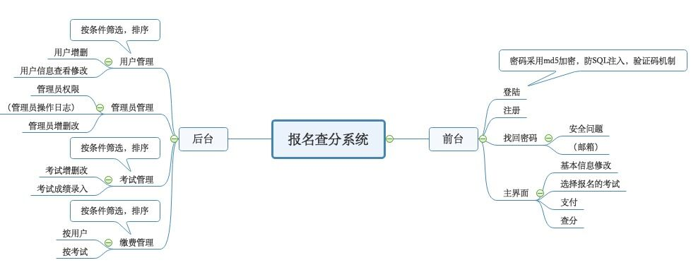

# 报名查分系统

## 基本功能模块

---
## 数据库设计
使用` node server/tools/initdb.js` 初始化数据库

用户登录表 
用户id|邮箱|状态|密码（MD5）

用户信息表 
用户id|姓名|性别|年龄|联系方式

科目名列表 
科目名|科目id|科目费用|报名截止时间|考试时间|限制规则

科目1情况表 
用户id|支付情况|分数

科目2情况表 
用户id|支付情况|分数

## API设计

使用 Postman 导入API设置
http://rap2api.taobao.org/postman/export?id=148593

